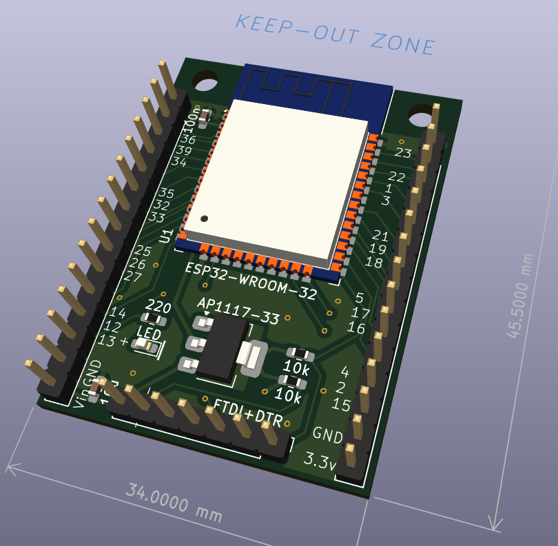

# ESP32 minimal board

For use with one of these PRC Uart adapters...

# Status

Working.

Gerber files do not show (all?) the footprint labels on silkscreen ?

# Usage

Plug the FTDI thing in the 6 right pins on the FTDI header.
Also make a connection from RTS on the FTDI adapter to the remaining left pin of the FTDI header. You can also connect 5V from the FTDI board to the Vin pin. Put the voltage select jumper on the FTDI board to 3.3V.

Now the ESP32 should get power (measure to the right of the FTDI header)
And it should be programmable from Arduino or PlatformIO.

The numbers on the outer pinheaders refere to the GPIO numbers.

# Ref

Inspired by  [this thing](https://electronoobs.com/eng_arduino_tut172.php)

# License

MIT
